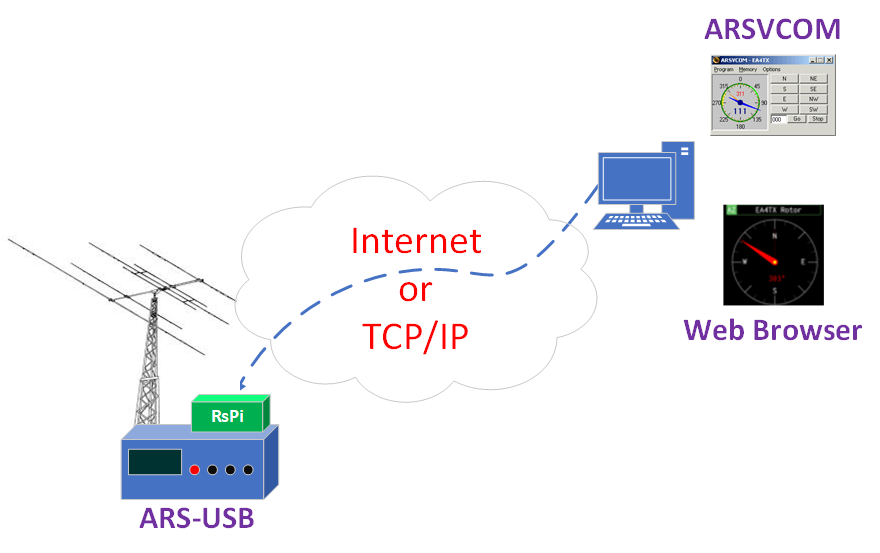

ARS-USB and Remote Control
============================

An excellent option for remote control of the motor through the ARS-USB, without the need to keep a desktop computer on 24 hours a day, is through a Raspberry Pi, Rock3, or similar device.

I suggest you visit this link where the setup is explained in detail
    https://ea4tx.com/faqs/remote-antenna-control

    Remote rotator Control Example

