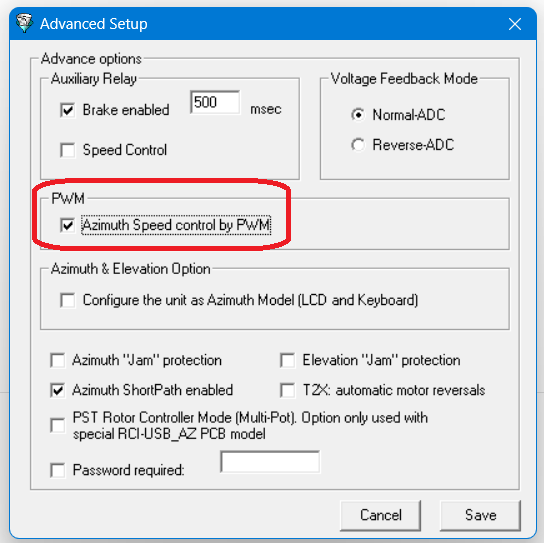

Rotator Speed
=========

With the ARS-USB, you can control the speed in some rotator models, but it's important to differentiate between the following cases:

    - ARS-USB connected to the original motor controller
    - ARS-USB functioning as the controller or motor controller itself

The current version of ARSVCOM can work with an ARS-USB, either through a serial port (USB) or remotely via TCP/IP.

.. topic:: ARS-USB connected to a controller

    In this case, if the controller is designed to rotate at 2 speeds, as may be the case with some Yaesu controllers (e.g., DXA/DXC), this can be managed through a pin to switch between High/Low speeds.
    The ARS, to control this pin, uses the AUX relay, following the expected wiring for these controllers, and by activating the speed control option in the software, it does so automatically.

.. topic:: ARS-USB as a controller

    When using the ARS-USB_Yaesu or ARS-USB_PST controller, to control the motor speed, the PWM (Pulse Width Modulation) option must be activated in the software (Advanced Menu). This option causes the ARS-USB controller to generate pulses that allow the motor to start and stop progressively and automatically for the user.
    This can be done with any type of direct current motor (regardless of the operating voltage: 12, 24, 48V).
    
