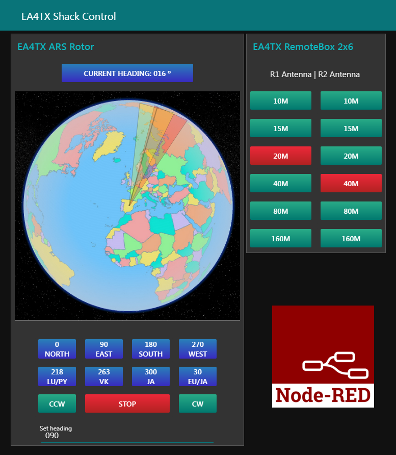

node-red
=========

Node-RED is a visual programming tool that visually displays relationships and functions, allowing users to program without having to write a single line of code. It is a browser-based flow editor where nodes can be added or removed and connected to each other to enable communication. It's an emerging, free, and highly attractive platform for integrating all kinds of accessories in the radio shack.

To simplify Node-RED's access to the ARS-USB, we'll use the ser2net service. This ser2net program acts as a router from a serial port to TCP/IP. So instead of using the serial port, Node-RED will use a TCP/IP connection.

Visit this link where the setup of Node-Red is explained:
    https://ea4tx.com/products-page/ars-usb/ars-remote/ars-nodered/

