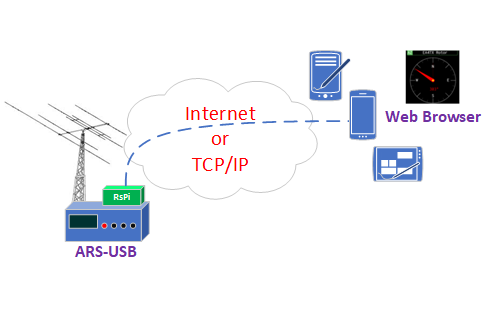

remoteRotator
=========

remoteRotator is an open-source program for multiple platforms (in this tutorial, we'll use a Rock-type mini-computer) developed by Tobi DH1TW, which provides a web interface to control the ARS. Since October 2023, the connection between this program and the ARS-USB can be TCP/IP, which is the suggested option to use. On one hand, the ser2net service will be installed, and when access to the defined port (e.g., 6001) is operational, continue with the installation as explained below.

Visit this link where the setup of remoteRotator service is explained:
    https://ea4tx.com/faqs/rspi/remoterotator/

