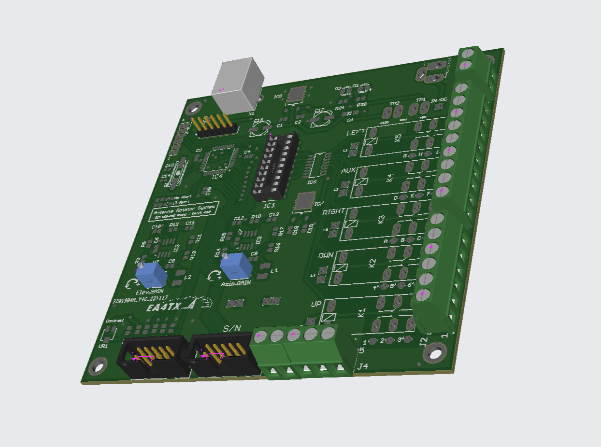
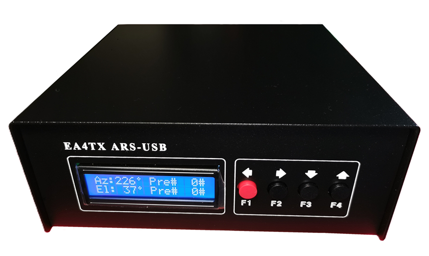

Introduction
================

.. intro::  
   :sorted:
 
The |Product| is the most comprehensive and possibly highest-performing universal motor interface on the market. It will allow you to control the positioning of your antenna(s) from the computer through the USB port.

The ARS is a universal interface, as it can be adapted to any type of motor; the user manual describes its connection, with a long list of supported motors.

In the :doc:`download` area, you can download the manuals and all available software.

The first version of the ARS appeared in 1996 and included the :doc:`models/rci` – a motor control interface board. Six years later, the card was redesigned and renamed: :doc:`models/rcise Card`.
These two interface models used a connection with the computer through the parallel port. In December 2011, the third generation of the product was introduced: :doc:`models/rciusb`, which includes a USB 2.0 port as an extra feature.
Finally, in 2024, the ARS-USB was restyled and converted for SMD mounting.

The |Product| is detected or seen on the computer as a Serial/COM port, so any program (satellite tracking, Log program, etc.) that configures such a port will be able to control it, without the need for additional software.
Additionally, the ARS-USB works with the same commands/instructions as the :term:Yaesu GS232A, which simplifies things, as this has the advantage that any program supporting this interface model will work with the ARS-USB.

Currently, there are 4 models available, 2 that serve to connect in parallel to the original controller and 2 to replace the controller:

    - ✅ **ARS-USB para Acimut**: To control a single Azimuth motor.
    - ✅ **ARS-USB para Acimut & Elevación**: To handle 2 motors: Azimuth and Elevation.
    - ✅ **ARS-USB_PST Controller**: Special version of the ARS-USB for Azimuth that replaces the original Prosistel controller; it can operate with multi-turn or standard potentiometers. Version for 12/24Vdc motors.
    - ✅ **ARS-USB_Yaesu Controller**: Special version of the ARS-USB for Azimuth that replaces any original controller (Yaesu, Kenpro, ...) operating at 24Vdc with a potentiometer.

.. hint:: 
    The ARS-USB can be connected to practically any type of motor, and the ARS-USB_Yaesu version can be connected to any motor that operates on direct current.

----------

.. warning:: **IMPORTANT:**
    No motor operating by pulses or encoder - instead of a potentiometer - is supported!

----------

🎓How does it work?
-------------
The operation of the ARS-USB is very simple and consists of two parts:

    - ✅ **Position Reading**: Responsible for reading the voltage provided by the potentiometer and converting it into Degrees.
    - ✅ **Rotation Control**: Responsible for providing the voltage to the motor so that it turns right or left (Up or down in elevation motors).

