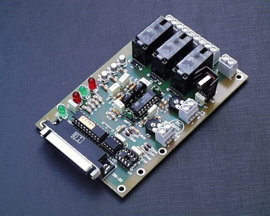

RCI - Rotor Control Interface
================

.. rci:: 
   :sorted:

This was the first version that was commercially available starting from 1996, after several years of testing with initial prototypes. It remained on the market until 2001 when it was redesigned and renamed RCI-SE (Rotor Control Interface - Second Edition).

It was designed with a parallel port interface since the few serial ports available at that time were usually already in use for other devices (modems, TNC, mouse, ...).

 