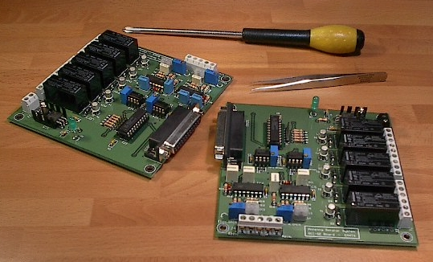

RCI - Second Edition
================

.. rcise:: 
   :sorted:

The second edition of the popular RCI, which was enjoying great success. Both the Azimuth and Elevation control systems are integrated into a single PCB, improving the design quality and adjustment or calibration.

This model was operational between 2002 and 2011.

 