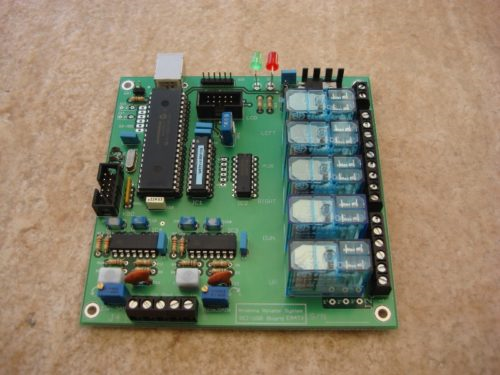

ARS-USB
================

.. rciusb:: 
   :sorted:

With the disappearance of parallel ports, the decision was made to redesign the hardware of the ARS, opting for the best solution, which is to employ a USB port. This USB port is detected by the computer as a serial port, which facilitates integration with other programs.

This new board is called ARS-USB and began to be marketed in 2011.

Additionally, it was decided to emulate or support the same commands as the Yaesu GS232A interface (a very popular and expensive Yaesu motor control interface). This way, any program that supports the GS232A would work with the ARS-USB without any changes.

 