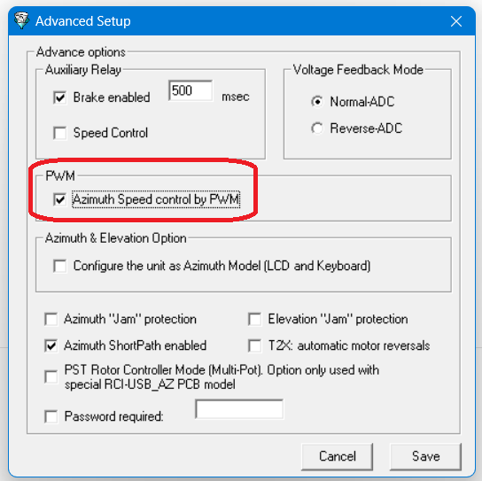

Velocidad
=========

Con el ARS-USB se puede controlar la velocidad en algunos modelos de motor, pero hay que diferenciar los siguientes casos:

    - ARS-USB conectado al mando original del motor
    - ARS-USB que funciona como controlador o mando del motor

La versión actual del ARSVCOM puede funcionar con un ARS-USB, sea por medio de un puerto serie (USB) o en remoto vía TCP/IP.

.. topic:: ARS-USB conectado a un mando

    En este caso, si el mando está preparado para girar a 2 velocidades, como puede ser el caso de algunos mandos Yaesu (p.e. DXA/DXC) por medio de un pin se puede manejar esa velocidad (Alta/Baja). 
    El ARS para controlar ese pin emplea el rele AUX y que siguiendo el conexionado previsto para esos mandos, y activando por software la opcion de control de velocidad, lo hace de forma automática.

.. topic:: ARS-USB como controlador

    Cuando se utiliza el mando ARS-USB_Yaesu o ARS-USB_PST el ARS, para controlar la velocidad del motor se ha de activar en el software (Menu avanzado) la opción PWM. Está opción hace que el controlador ARS-USB genere unos pulsos que permiten que el arranque y parada del motor se realice de forma progresiva y automática para el usuario. 
    Esto se puede hacer con cualquier motor tipo corriente continua (no importa la tensión de funcionamiento: 12, 24, 48V)

