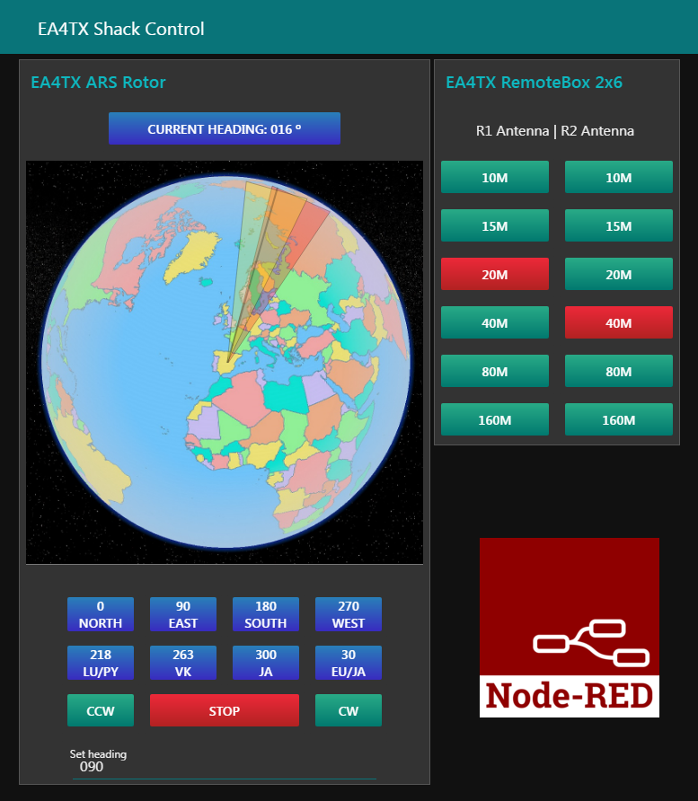

node-red
=========

Node-RED es una herramienta de programación visual. Muestra visualmente las relaciones y funciones, y permite al usuario programar sin tener que escribir una línea de código. Node-RED es un editor de flujo basado en el navegador donde se puede añadir o eliminar nodos y conectarlos entre sí con el fin de hacer que se comuniquen entre ellos. Es una plataforma emergente, gratuita y muy atractiva para integrar todo tipo de accesorios del cuarto de radio.

Para simplificar el acceso de Node-Red al ARS-USB, vamos a usar el servicio ser2net. Este programa ser2net hace las veces de enrutador de puerto serie a TCP/IP luego desde Node-Red en vez de utilizar el puerto serie, se empleará una conexión TCP/IP.

Visita este enlace donde se explica la puesta en marcha de Node-Red:
    https://ea4tx.com/products-page/ars-usb/ars-remote/ars-nodered/

