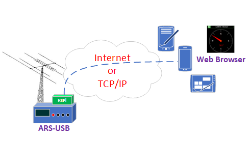

remoteRotator
=========

remoteRotator es un programa de código abierto para múltiples pataformas (en este tutorial usaremos un miniordenador tipo Rock) desarrollado por Tobi DH1TW que proporciona un interface WEB al control del ARS. Desde octubre 2023, la conexión entre este programa y el ARS-USB puede ser tipo TCP/IP u es la opción que sugiero usar. Por un lado se instalará el servicio ser2net y cuando el acceso al puerto definido (p.e. 6001) esté operativo, seguir con la instalación que se explica a continuación.

Visita este enlace donde se explica la puesta en marcha de este servicio remoteRotator:
    https://ea4tx.com/faqs/rspi/remoterotator/

