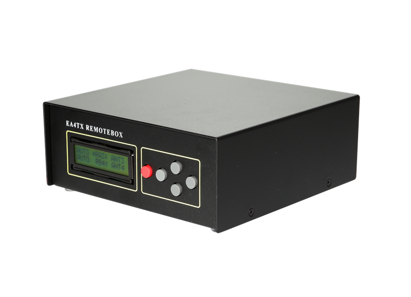
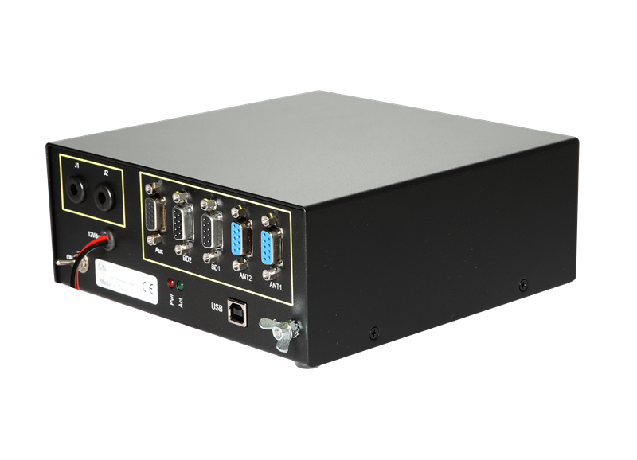

🗒️Introducción
================

.. intro::  
   :sorted:
 
RemoteBox es un avanzado controlador de conmutadores de antena universal diseñado para radioaficionados que buscan optimizar y simplificar la gestión de sus sistemas de antenas. 
Este dispositivo innovador, desarrollado por EA4TX, ofrece una solución integral para controlar de manera remota y local múltiples conmutadores de antena, permitiendo una gestión eficiente y sin complicaciones de las antenas de una estación de radio.

El RemoteBox se destaca por su versatilidad y facilidad de uso. Con su diseño compacto y robusto, se integra perfectamente en cualquier configuración de estación de radio, ya sea en el hogar o en un entorno remoto. Además, su interfaz intuitiva y amigable permite una configuración rápida y sencilla, incluso para aquellos con poca experiencia técnica.

Una de las características más destacadas del RemoteBox es su capacidad para controlar conmutadores de antena de diferentes marcas y modelos de forma universal. Esto significa que los radioaficionados pueden utilizar el RemoteBox con una amplia variedad de conmutadores de antena disponibles en el mercado, lo que ofrece una flexibilidad excepcional para adaptarse a las necesidades específicas de cada estación de radio.

Además de su función principal como controlador de conmutadores de antena, el RemoteBox también ofrece otras características y beneficios importantes. Entre ellas se incluye la capacidad de monitorear el estado de las antenas en tiempo real, proporcionando información crucial sobre su rendimiento y funcionamiento. 

En resumen, RemoteBox es mucho más que un simple controlador de conmutadores de antena: es una herramienta indispensable para cualquier radioaficionado que busca maximizar el rendimiento y la eficiencia de su estación de radio. Con su diseño innovador, su funcionalidad universal y su facilidad de uso, el RemoteBox ofrece una solución completa para la gestión de antenas, proporcionando a los usuarios un control total sobre su sistema de antenas, tanto de forma remota como local.

En la zona de  :doc:`descarga`, podrás bajarte los manuales y todo el software disponible.

Algunos de los conmutadores de antena soportados son:
    - ✅ SixPack (2×6)
    - ✅ SJ2W (1×6 y 2×6)
    - ✅ MicroHAM (Six Switch, Double Six Switch, ..)
    - ✅ RemoteQTH (1×6, 2×6)
    - ✅ Ameritron (RCS-8, RCS-10)
    - ✅ DX Engineering Antenna Switches (DXE-RR8B-HP, DXE-RR8B-SD, DXE-RR2X8B )
    - ✅ Cualquiera de nuestros modelos (AS1x6, AS1x8, AS2x6, AS2x8)

.. hint:: 
    El ARS-USB se puede conectar con practicamente cualquier conmutador de antenas. Contact con EA4TX en caso que no esté el tuyo en la lista

----------

.. warning:: **IMPORTANTE:**
    El Ameritron RCS-4 no está soportado pues requiere que sea controlado por el mismno coaxial y no por una manguera de control.

----------

