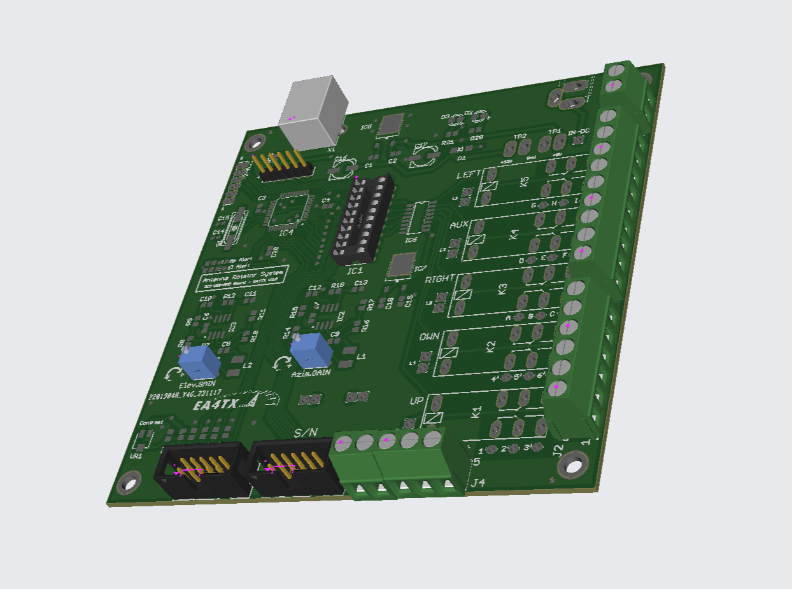
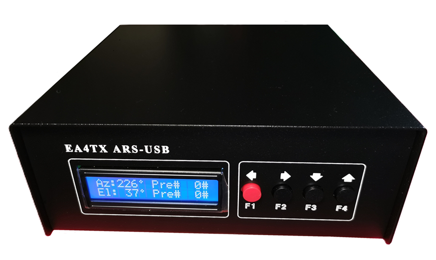

🗒️Introducción
================

.. intro::  
   :sorted:
 
El |Product| es el interface de motor universal más completo y posiblemente con mejor rendimiento del mercado. Te permitirá controlar el posicionamiento de tu(s) antena(s) desde el ordenador por medio del puerto USB.

El ARS es un interface universal, puesto que se puede adaptar a cualquier tipo de motor; el manual de usuario describe el conexionado de éste, con una larga lista de motores soportados.

En la zona de  :doc:`descarga`, podrás bajarte los manuales y todo el software disponible.

La primera versión del ARS aparece en 1996 e incluía la Tarjeta :doc:`modelos/rci` – placa de interface con el mando del motor. 6 años más tarde, se rediseña la tarjeta y pasa a llamarse: Tarjeta :doc:`modelos/rcise` . 
Estos dos modelos de interface usaban una conexión con el ordenador por medio de puerto paralelo. En Diciembre de 2011, se presenta la tercera generación del producto: :doc:`modelos/rciusb`, que incluye como extras un puerto USB 2.0.
Finalmente en el 2024 se reestiliza el ARS-USB y se convierte para el montaje SMD.

El |Product| es detectado o visto en el ordenador como un puerto Serie/COM, por lo que cualquier programa (seguimiento de satélites, programa de Log, etc) que configure dicho puerto, lo va a poder controlar, sin necesidad de software adicional.
Además, el ARS-USB funciona con los mismos comandos/instrucciones que el  :term:`Yaesu GS232A`, lo que hace las cosas más sencillas, puesto que esto tiene la ventaja de que cualquier programa que soporte este modelo de interface, va a funcionar con el ARS-USB.

Actualmene hay 4 modelos disponibles, 2 que sirven para conectarse en paralelo al mando original y 2 para reemplazar el mando:

    - ✅ **ARS-USB para Acimut**: Para controlar un único motor de Acimut.
    - ✅ **ARS-USB para Acimut & Elevación**: Para manejar 2 motores: Acimut y Elevación.
    - ✅ **Mando ARS-USB_PST**: Versión especial del ARS-USB de Azimuth que sustituye al mando original Prosistel; puede operar con potenciómetros multivuelta o standards. Versión para motores de 12/24Vcc
    - ✅ **Mando ARS-USB_Yaesu**: Versión especial del ARS-USB de Azimuth que sustituye cualquier mando original (Yaesu, Kenpro, ...) que opere a 24Vcc con potenciometro. 

.. hint:: 
    El ARS-USB se puede conectar con practicamente cualquier tipo de motor y la version del ARS-USB_Yaesu se puede conectar con cualquier motor que funcione en corriente continua. 

----------

.. warning:: **IMPORTANTE:**
    Ningún motor que funcione por pulsos o encoder - en vez de potenciometro - está soportado! 

----------

🎓Cómo funciona?
-------------
El funcionamiento del ARS-USB es muy sencillo y consta de dos partes:

    - ✅ **Lectura de la posición**: Encargada de leer la tensión proporcionada por el potenciometro y convertirla en Grados.
    - ✅ **Control del Giro**: Encargada de proporcionar la tensión al motor para que éste gire a derecha o izquierda (Arriba o abajo en los de elevación).

