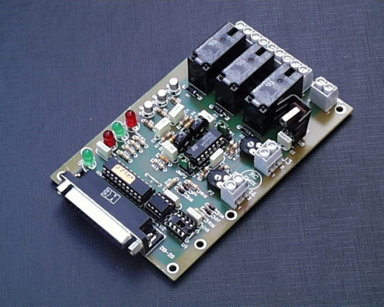

RCI - Rotor Control Interface
================

.. rci:: 
   :sorted:

Esta fue la primera versión que se comercializó a partir de 1996, después de varios años de pruebas con unos primeros prototipos. Estuvo en el mercado hasta el año 2001 que se rediseña y pasa a llamarse RCI-SE (Rotor Control Interface - Second Edition).

Se diseña con interface de puerto paralelo ya que los pocos puertos serie que había entonces ya solían estar usados para otros equipos (modems, TNC, ratón, ...)

 