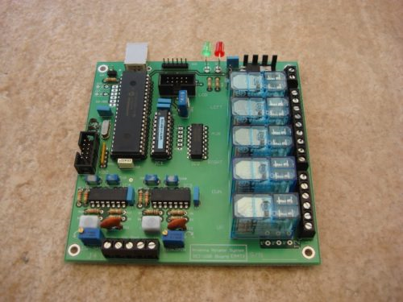

ARS-USB
================

.. rciusb:: 
   :sorted:

Con la desaparición de los puertos paralelos, se decide rediseñar el hardware del ARS y se adopta la mejor opción y que es emplear un puerto USB. Este puerto USB es detectado por el ordenador como un puerto serie lo cual facilita la integración con otros programas.

A esta nueva placa se la denomina ARS-USB y se comienza a comercializar en 2011.

Además se opta por emular o soportar los mismo comandos que el interface Yaesu GS232A (un interface de control de motores de Yaesu muy popular al igual que caro), de esta forma cualquier programa que soporte el GS232A, iba a funcionar con el ARS-USB sin cambio alguno.

 